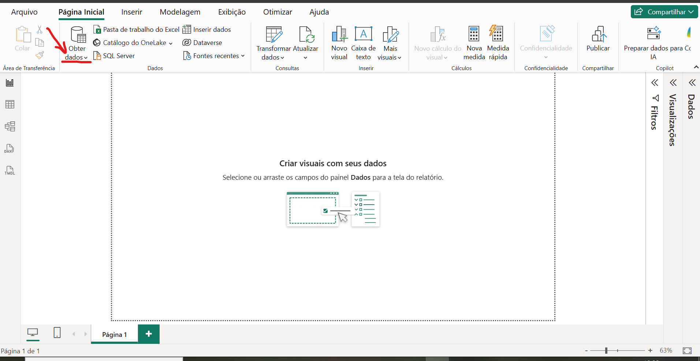
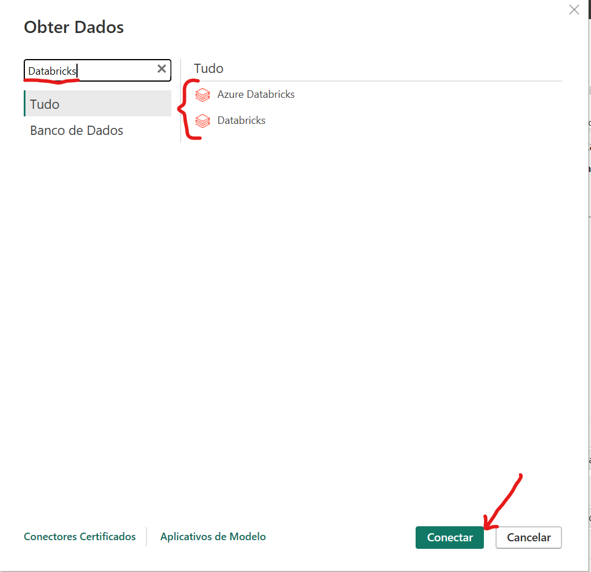
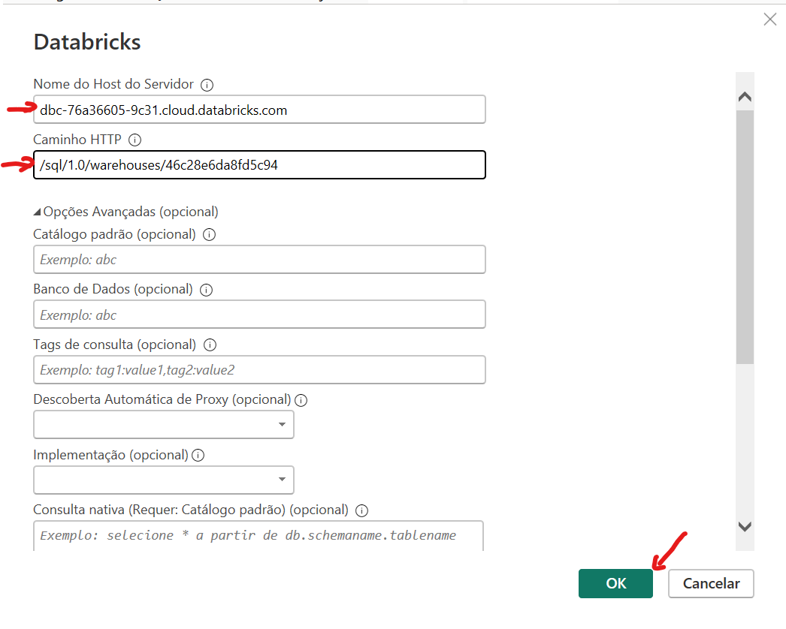
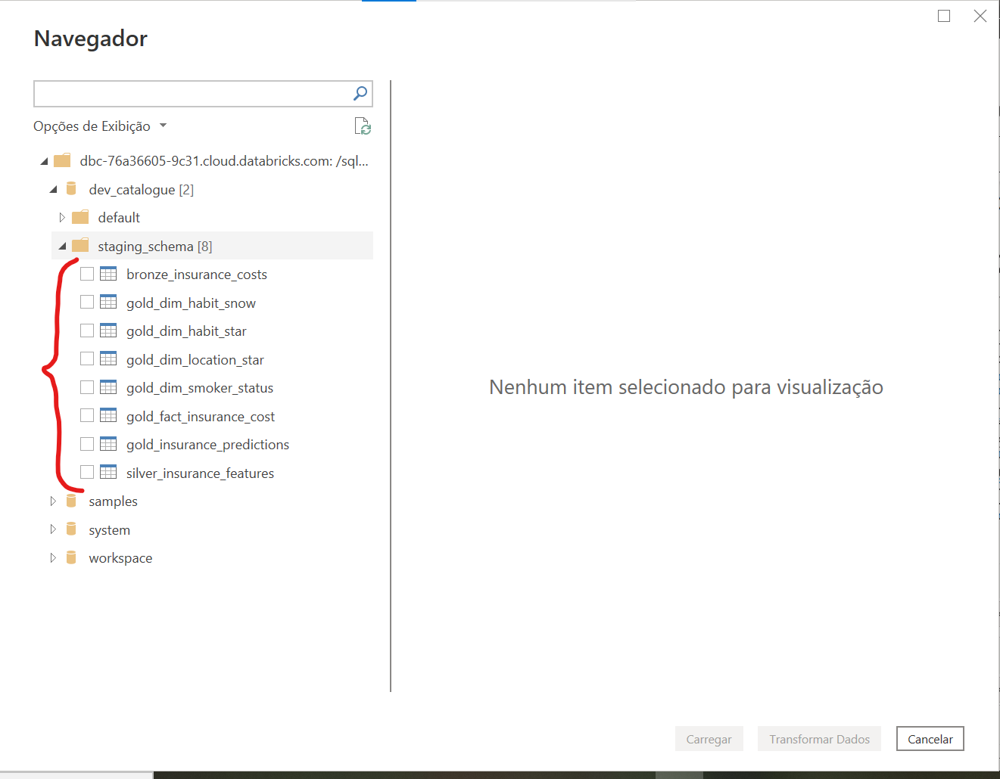
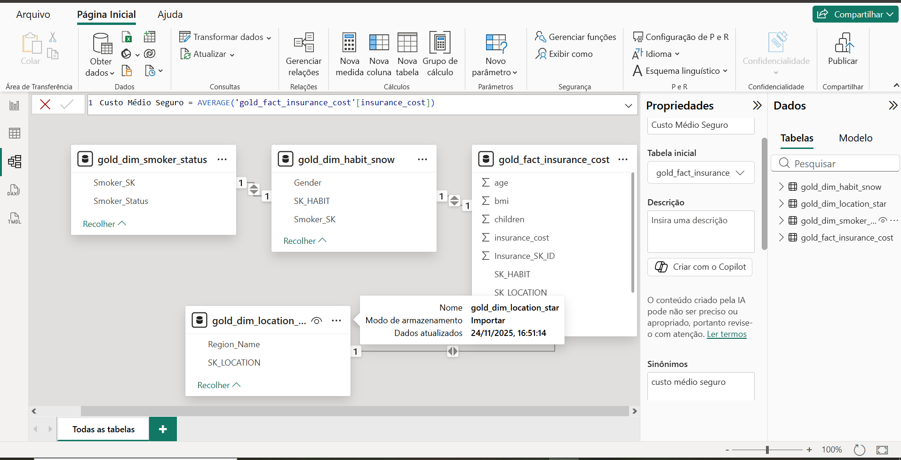
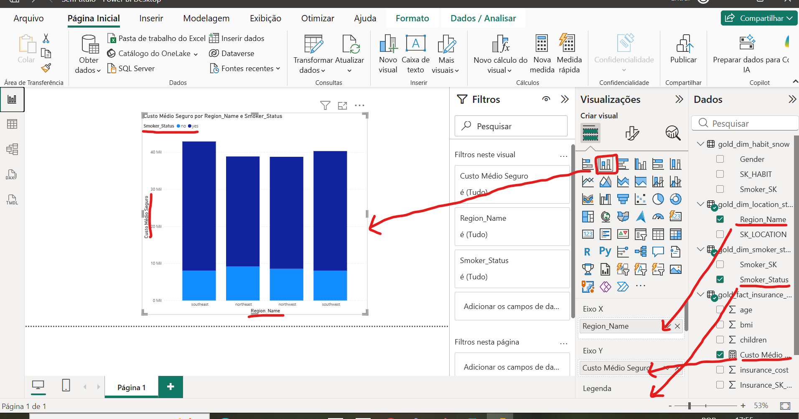

# 🏆 BI e MLOps: Modelagem Dimensional do Custo de Seguro Saúde

Este projeto estabelece uma arquitetura robusta de dados e MLOps no Databricks, utilizando o *dataset* de Custos de Seguro Saúde. O objetivo principal é demonstrar e comparar a implementação de diferentes modelos de dados dimensionais – **Esquema Estrela** e **Esquema Floco de Neve (Snowflake)** – dentro da **Camada Gold** da arquitetura Medalhão.

O fluxo de trabalho segue as melhores práticas, incluindo versionamento de código via Git/GitHub e a configuração de um ambiente estável (DBR LTS) para as operações de ETL e o posterior consumo de BI.

## 1. ⚙️ Arquitetura do Projeto (Medalhão)

A pipeline de dados utiliza a arquitetura Medalhão (Bronze, Silver, Gold) sobre o **Delta Lake** e o **Unity Catalog**.

| Camada | Objetivo | Conteúdo |
| :--- | :--- | :--- |
| **Bronze (Raw)** | Ingestão de dados brutos, mantendo o formato original (auditável). | CSV carregado do Volume. |
| **Silver (Cleaned)** | Limpeza, padronização de colunas e criação de **Chaves Substitutas (SKs)**. | Tabela de features pronta para modelagem. |
| **Gold (Business)** | Modelagem dimensional com **Esquema Estrela** (para performance) e **Esquema Floco de Neve** (para normalização/BI). | Tabela Fato e 6 Tabelas de Dimensão. |

---

## 2. 🐍 Execução da Pipeline ETL (Databricks)

O notebook principal (`01_Data_Ingestion_Medallion.py`) executa o fluxo completo do ETL.

### 2.1. Camada Bronze: Ingestão de Dados

Lê o arquivo `insurance.csv` do **Volume** do Unity Catalog e o salva como uma Tabela Delta.

**Saída da Célula 1:**

| Coluna | Tipo | Exemplo |
| :--- | :--- | :--- |
| age | integer | 19 |
| sex | string | female |
| bmi | double | 27.9 |
| children | integer | 0 |
| smoker | string | yes |
| region | string | southwest |
| charges | double | 16884.924 |

```text
✅ Camada BRONZE atualizada com sucesso na Tabela Delta: dev_catalogue.staging_schema.bronze_insurance_costs
````
###  2.2. Camada Silver: Limpeza e Chaves Substitutas

Padronização de colunas (`charges` para `insurance_cost`) e criação das **Chaves Substitutas (SKs)** essenciais para a modelagem dimensional.

**Saída da Célula 2 (Com SKs):**

| Coluna | Tipo | Exemplo |
| :--- | :--- | :--- |
| **SK_ID** | long | 0 |
| **SK_LOCATION** | long | 0 |
| **SK_HABIT** | long | 0 |
| **SK_TIME** | int | 20250101 |
| age | int | 19 |
| sex | string | female |
| region | string | southwest |
| **insurance_cost** | double | 16884.924 |

PlaintextTotal de registros na SILVER: 1338

✅ Camada SILVER (Limpa e com SKs) salva com sucesso em: dev_catalogue.staging_schema.silver_insurance_features
### 2.3. Camada Gold: Implementação Dimensional

Separação da Tabela Fato e criação das Dimensões para os modelos Estrela e Floco de Neve.

**Saída da Célula 3 (Tabelas Gold Criadas):**

| Tabela | Arquitetura | Tipo |
| :--- | :--- | :--- |
| `gold_fact_insurance_cost` | Geral | Tabela Fato Central |
| `gold_dim_location_star` | Estrela | Dimensão Desnormalizada (Região) |
| `gold_dim_habit_star` | Estrela | Dimensão Desnormalizada (Hábito/Fumante) |
| `gold_dim_habit_snow` | Floco de Neve | Dimensão Intermediária |
| `gold_dim_smoker_status` | Floco de Neve | Sub-Dimensão Normalizada |

```text
✅ FLUXO DE DADOS COMPLETO: BRONZE -> SILVER -> GOLD (STAR/SNOWFLAKE)
````

## 3. 📊 Fase de Business Intelligence (Power BI)

A modelagem **Floco de Neve** foi usada para a visualização externa no Power BI, demonstrando a necessidade de maior normalização.

### 3.1. Conexão com o Databricks

O Power BI se conecta ao **SQL Warehouse** do Databricks usando o conector nativo e autenticação via Personal Access Token (PAT).

| Passo | Ação | Imagem |
| :--- | :--- | :--- |
| 1 | Selecionar Obter Dados (**Get Data**) na Home. |  |
| 2 | Buscar o conector "Databricks". |  |
| 3 | Informar **Hostname** e **HTTP Path** do SQL Warehouse. |  |

### 3.1. Validação do Esquema Estrela (Star Schema) via Databricks SQL

O Esquema Estrela foi validado com uma consulta de agregação para garantir a simplicidade e a performance das *queries* analíticas, utilizando apenas duas junções diretas da Tabela Fato para as Dimensões desnormalizadas (`gold_dim_location_star` e `gold_dim_habit_star`).

**Query Executada:**

```sql
SELECT
    DL.Region_Name,
    DH.Smoker_Status,
    DH.Gender,
    COUNT(F.Insurance_SK_ID) AS Total_Policies,
    AVG(F.insurance_cost) AS Average_Cost
FROM
    dev_catalogue.staging_schema.gold_fact_insurance_cost AS F
JOIN
    dev_catalogue.staging_schema.gold_dim_location_star AS DL
    ON F.SK_LOCATION = DL.SK_LOCATION
JOIN
    dev_catalogue.staging_schema.gold_dim_habit_star AS DH
    ON F.SK_HABIT = DH.SK_HABIT
GROUP BY 1, 2, 3
ORDER BY Average_Cost DESC
```
**Resultado da Consulta (Custo Médio de Seguro):**

| Region_Name | Smoker_Status | Gender | Total_Policies | Average_Cost |
| :--- | :--- | :--- | :--- | :--- |
| southeast | yes | male | 55 | 36029.84 |
| southeast | yes | female | 36 | 33034.82 |
| southwest | yes | male | 37 | 32598.86 |
| southwest | yes | female | 21 | 31687.99 |
| northeast | yes | male | 38 | 30926.25 |
| northwest | yes | male | 29 | 30713.18 |
| northwest | yes | female | 29 | 29670.82 |
| northeast | yes | female | 29 | 28032.05 |
| northeast | no | female | 132 | 9640.43 |
| northwest | no | female | 135 | 8786.99 |
| northeast | no | male | 125 | 8664.04 |
| southeast | no | female | 139 | 8440.21 |
| northwest | no | male | 132 | 8320.69 |
| southwest | no | female | 141 | 8234.09 |
| southwest | no | male | 126 | 7778.91 |
| southeast | no | male | 134 | 7609.00 |

### 3.2. Carregamento e Modelagem do Snowflake

As tabelas Gold são carregadas e os relacionamentos do Floco de Neve são estabelecidos:

| Passo | Ação | Imagem |
| :--- | :--- | :--- |
| 4 | Visualização e seleção das tabelas Gold (Fato e Dimensões). |  |
| 5 | Seleção das tabelas para o modelo Snowflake (`fact_cost`, `dim_habit_snow`, `dim_smoker_status`, `dim_location_star`). |  |
| 6 | **Modelo Semântico Final (Snowflake):** A Tabela Fato exige duas junções para acessar o status do fumante. | |

### 3.3. Visualização e Interpretação

O **Gráfico de Colunas Agrupadas** foi escolhido para comparar o Custo Médio do Seguro por Região e Status de Fumante.

| Visual | Interpretação | Imagem |
| :--- | :--- | :--- |
| **Gráfico de Colunas Agrupadas** | Revela que o **Status de Fumante** é o *driver* de custo dominante e primário (colunas 'yes' são 3x a 4x maiores que as 'no'). A variação regional é secundária. |  |
